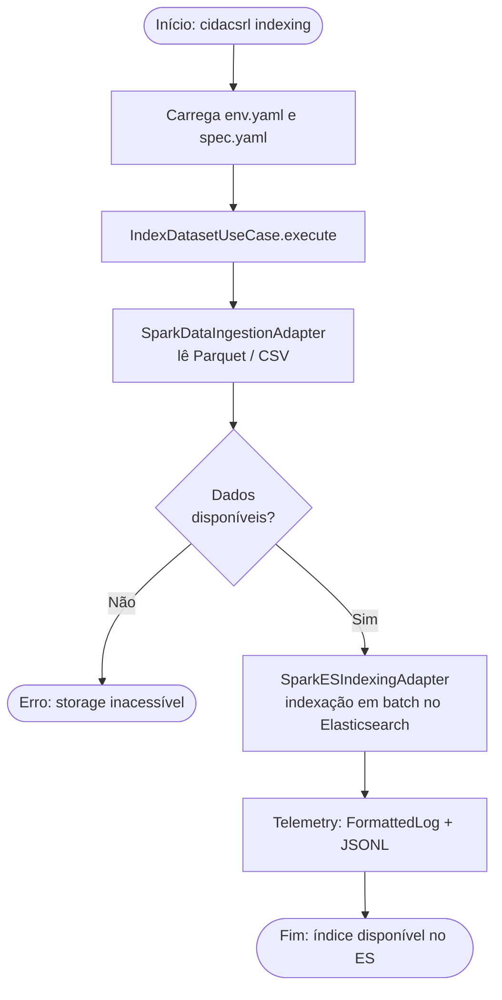
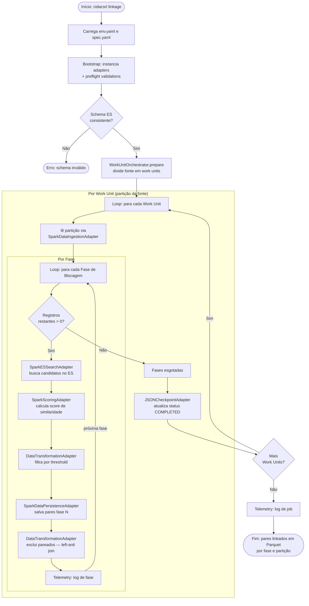
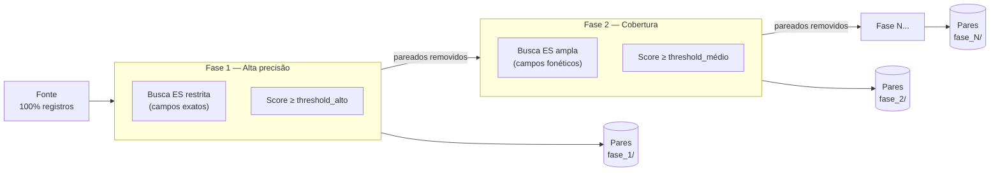
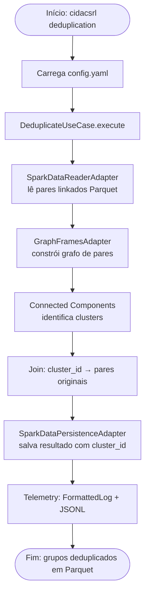
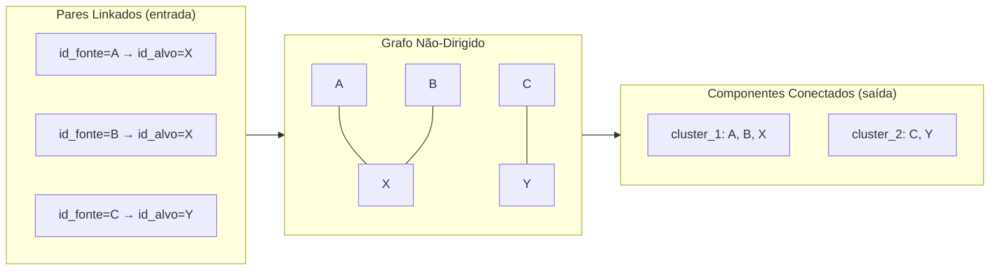
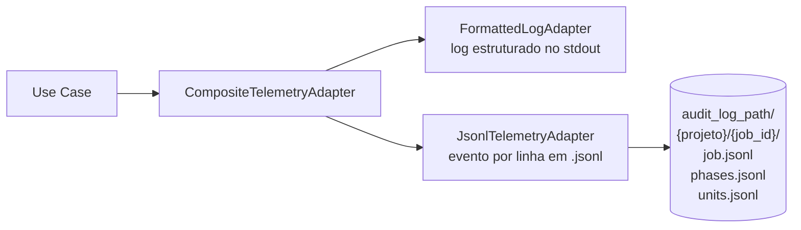

# Fluxos de Execução

Cada subcomando da CLI executa um pipeline distinto. Abaixo estão os fluxos detalhados de cada um.

---

## Pipeline de Indexação

Prepara a base alvo para busca de candidatos, indexando os registros no Elasticsearch.

---

## Pipeline de Linkage

Núcleo da plataforma. Executa blocagem por Elasticsearch e scoring probabilístico por Spark em múltiplas fases sequenciais.

### Estratégia de Blocagem Multifase

Cada fase define suas próprias regras de comparação e threshold. Registros pareados com alta confiança em uma fase são **removidos** das fases subsequentes (left-anti join), garantindo que cada par apareça em apenas uma fase.

---

## Pipeline de Deduplicação

Resolve os pares linkados em grupos de entidades únicas usando algoritmo de componentes conectados (GraphFrames).

### Modelo de Grafo

---

## Telemetria e Auditoria

Todos os pipelines emitem eventos de telemetria usando o **padrão Composite**: múltiplos adapters recebem o mesmo evento simultaneamente.

