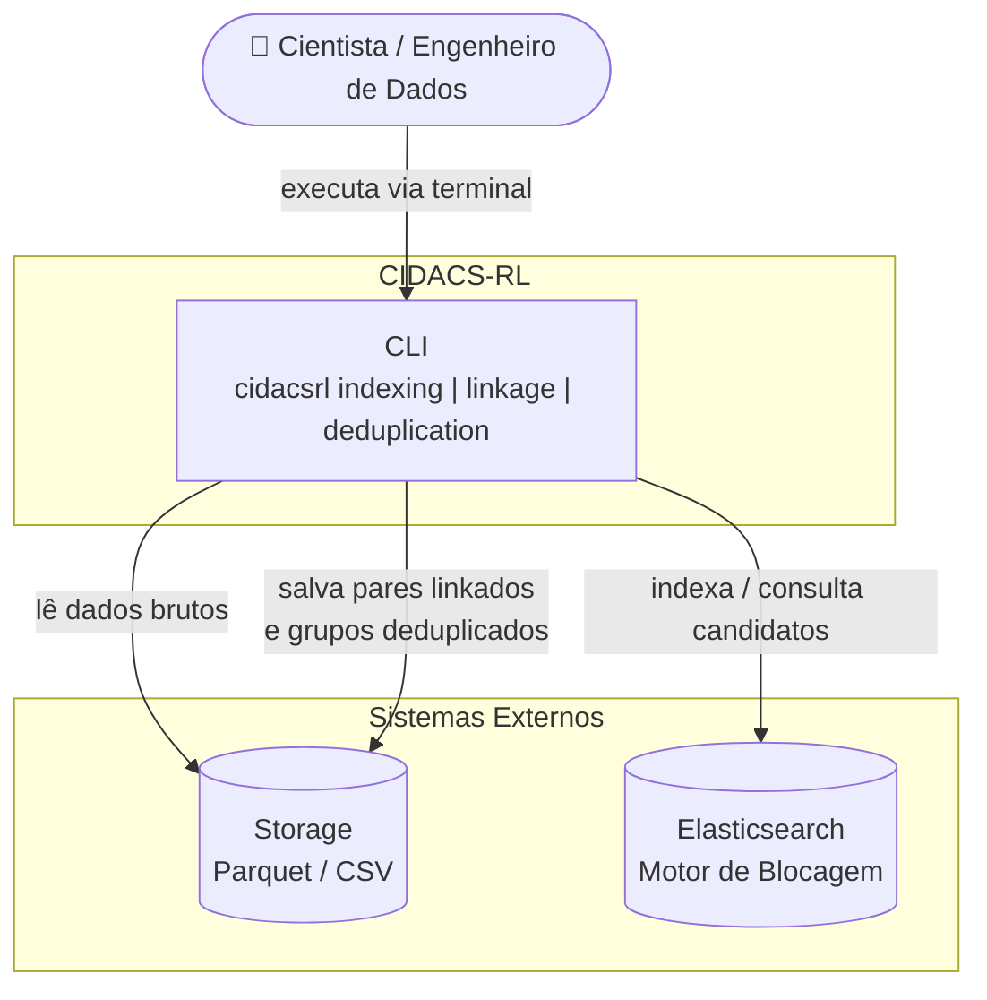
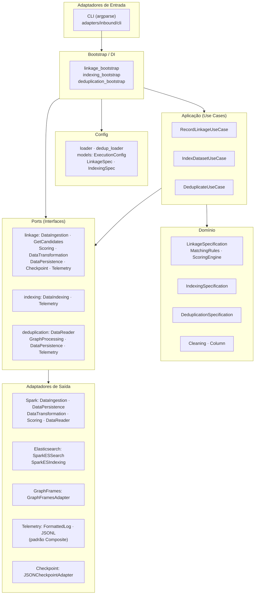
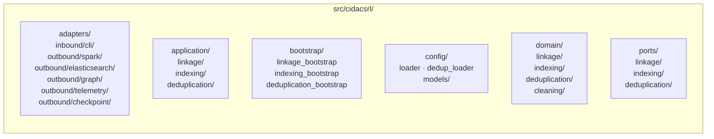
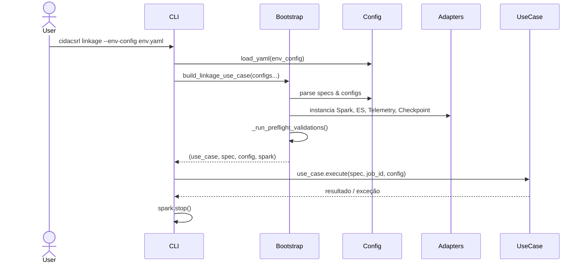

# Visão Geral da Arquitetura

A CIDACS-RL segue o padrão **Hexagonal (Ports & Adapters)**, com três verticais independentes: **Linkage**, **Indexing** e **Deduplication**. Cada vertical possui seu próprio conjunto de ports (interfaces) e adapters (implementações), orquestrado por um use case na camada de aplicação.

---

## Contexto do Sistema

O diagrama abaixo mostra como a CIDACS-RL se posiciona em relação aos atores e sistemas externos.

---

## Arquitetura em Camadas

A plataforma é organizada em seis camadas com fluxo de dependência de fora para dentro — nenhuma camada interna conhece as externas.

---

## Estrutura de Pacotes

---

## Padrão de Injeção de Dependências

Não há contêiner de DI — o **Bootstrap** instancia e conecta todos os objetos manualmente, seguindo o padrão *Poor Man's DI*. A CLI chama o bootstrap, que retorna o use case já montado com todas as dependências injetadas.

